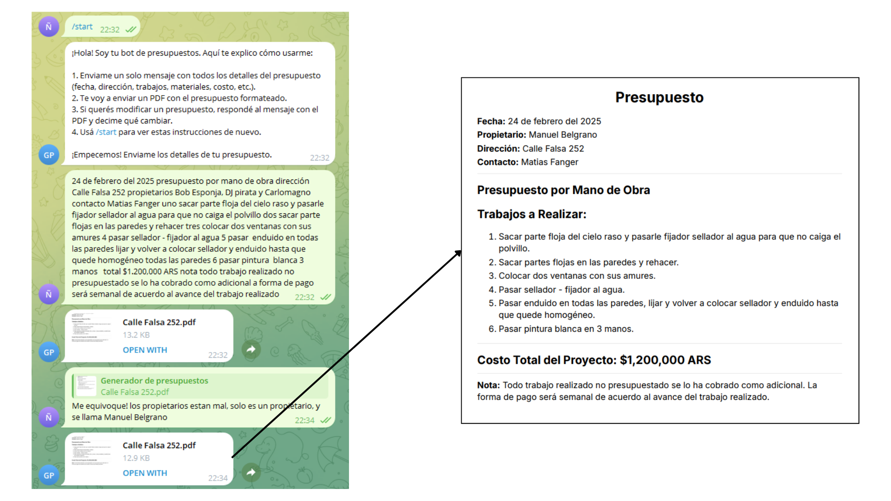

# 💰 PresuGenBot



## 🚀 Descripción
Bot de Telegram para crear presupuestos rapidos y sencillos.

## ✨ Características
- Genera un PDF a partir de un texto en formato MD, usando IA: gpt-4o-mini.

## 🛠️ Instalación

```bash
# Clonar el repositorio
git clone https://github.com/matifanger/PresuGenBot.git

# Entrar al directorio
cd PresuGenBot

# Instalar dependencias
pip install -r requirements.txt

# Configurar variables de entorno
cp .env.example .env
# Edita el archivo .env con tus credenciales
```

## 🔧 Configuración
1. Obtén un token de bot de Telegram a través de [@BotFather](https://t.me/botfather)
2. Configura las variables de entorno en el archivo `.env`
3. ¡Listo para usar!

## 🚀 Uso
```bash
python main.py
```

## 🐳 Docker
```bash
# Construir la imagen
docker build -t PresuGenBot .

# Ejecutar el contenedor
docker run -d --env-file .env PresuGenBot
```

## 📝 Licencia
Este proyecto está bajo la Licencia MIT - mira el archivo [LICENSE](LICENSE) para más detalles

## 👥 Contribuir
Las contribuciones son bienvenidas.